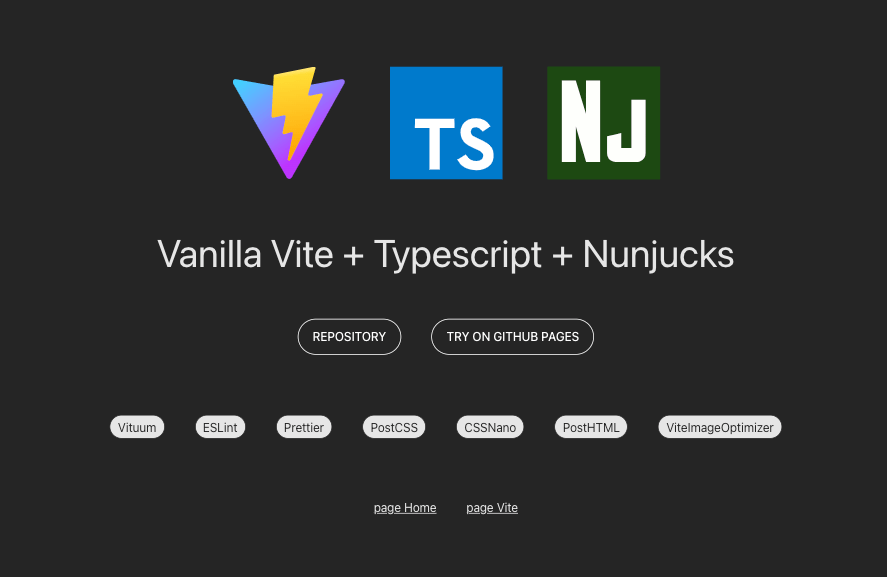

# Vite Vanilla TS Nunjucks Template


---



Template for starting a new multi-page project with Vite.js, Typescript, SCSS and Nunjucks.
It's already equipped with standard development tools like ESLint and Prettier.

---

## Dependencies

- **[Vite](https://vitejs.dev/):** A frontend build tool that offers a fast development server and optimized builds.

- **[Vituum](https://vituum.dev/):** to support multi-pages.

- **[Nunjucks](https://mozilla.github.io/nunjucks/templating.html):** HTML template engine.

- **[SASS](https://sass-lang.com/)**

- **[ESLint](https://eslint.org/):** An open-source JavaScript linting utility that helps maintain a consistent code style.

- **[Prettier](https://prettier.io/):** An opinionated code formatter that enforces a consistent style across your project.

- **[PostCSS](https://postcss.org/):** PostCSS provides a way to transform CSS with JavaScript.

- **[CSSNano](https://cssnano.co/):** A tool that helps to compress and optimize CSS files.

- **[PostHTML](https://vituum.dev/plugins/posthtml):** PostHTML provides a way to transform HTML with JavaScript.

- **[ViteImageOptimizer](https://github.com/FatehAK/vite-plugin-image-optimizer):** Optimizing images using [Sharp.js](https://github.com/lovell/sharp) and [SVGO](https://github.com/svg/svgo).

- **[the-new-css-reset](https://elad2412.github.io/the-new-css-reset/):** A package that resets some of the default, user agent based, styles.

---

## Scripts

```bash
# Start the development server
npm run dev
```

```bash
# Build for production
npm run build
```

```bash
# Preview the build
npm run preview
```

```bash
# Formats your code in a consistent, predefined style using Prettier
npm run format
```

```bash
# Tries to automatically fix any linting errors present in your code
npm run eslint
```

```bash
# Formats your code and automatically fix any linting errors
npm run lint
```
---

## Folder Structure

This is the structure of the project:

```plaintext
/
├── public                       # Public assets and resources
├── src                          # Source code
│   ├── assets                   # General assets for your project
│   │   ├── fonts                
│   │   ├── images               
│   │   ├── svg                  
│   ├── blocks                   # Independent page sections
│   │   ├── block                # Block directiry
│   │   │   ├──  block.njk       # Block
│   │   │   ├──  block.scss      # Styles for block
│   ├── components               # Reusable page components
│   │   ├── component            # Component directiry
│   │   │   ├──  component.njk   # Component
│   │   │   ├──  component.scss  # Styles for component
│   ├── extends                  # njk page templates
│   ├── pages                    # HTML/njk page files
│   ├── scripts                  # Typescript files of your project
│   ├── styles                   # SCSS/CSS styles for your project
│   │   ├── pages                # SCSS styles for pages
│   │   ├── global.scss          # Global styles
│   │   ├── index.scss           # All styles are imported into this file
├── .eslintignore                # Files to be ignored by ESLint
├── .eslintrc.json               # Configuration for ESLint
├── .gitignore                   # Files and folders to be ignored by Git
├── .prettierignore              # Files to be ignored by Prettier
├── .prettierrc                  # Configuration for Prettier
├── package.json                 # Defines your project and its dependencies
├── README.md                    # This file
├── vite.config.js               # Configuration for Vite
```

---

How to add syntax highlighting to Nunjucks template files in IntelliJ IDEA/Webstorm:

1. add Twig Support plugin if necessary
2. Go to `Settings` -> `Editor` -> `File Types` and find `Twig`
3. Add the custom pattern `*.njk`.

Now all `.njk` files are parsed as Twig and you have support for Nunjucks.

---

Happy coding! 👨‍💻